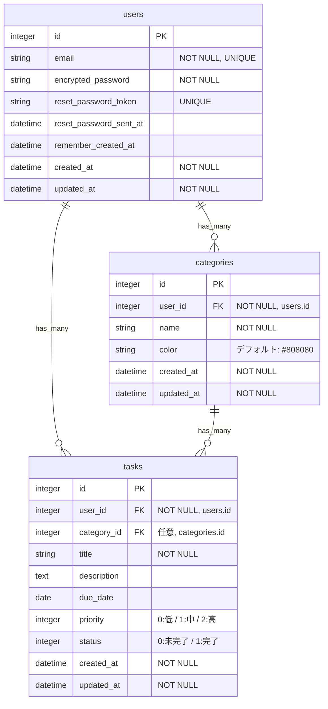

# ER図 - タスク管理アプリ

## テーブル関連図

## リレーション

| 関係 | 種類 | 説明 |
|------|------|------|
| users → tasks | 1対多 | 1人のユーザーが複数のタスクを持つ |
| users → categories | 1対多 | 1人のユーザーが複数のカテゴリを持つ |
| categories → tasks | 1対多 | 1つのカテゴリに複数のタスクが属する |
| tasks → users | 多対1 | 各タスクは1人のユーザーに属する（必須） |
| tasks → categories | 多対1 | 各タスクは1つのカテゴリに属する（任意） |

## Enum定義

### priority（優先度）
| 値 | ラベル |
|----|--------|
| 0  | 低     |
| 1  | 中     |
| 2  | 高     |

### status（ステータス）
| 値 | ラベル |
|----|--------|
| 0  | 未完了 |
| 1  | 完了   |

## バリデーション

### users
- `email`: 必須、一意、メール形式（Deviseが自動管理）
- `encrypted_password`: 必須（Deviseが自動管理）
- `reset_password_token`: 一意（Deviseが自動管理）

### categories
- `user_id`: 必須、usersテーブルへの外部キー
- `name`: 必須
- `color`: デフォルト値 `#808080`（グレー）
- 同一ユーザー内で `name` の重複不可

### tasks
- `user_id`: 必須、usersテーブルへの外部キー
- `category_id`: 任意、categoriesテーブルへの外部キー
- `title`: 必須
- `priority`: デフォルト値 1（中）
- `status`: デフォルト値 0（未完了）
